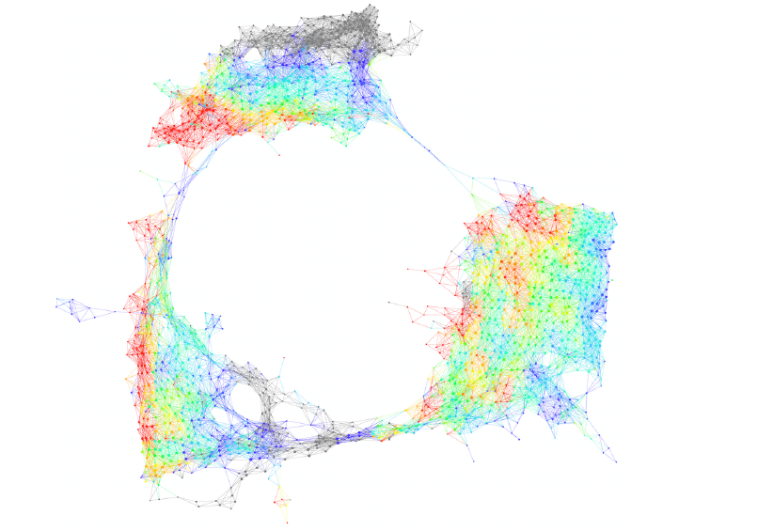
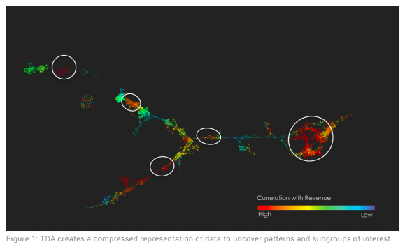
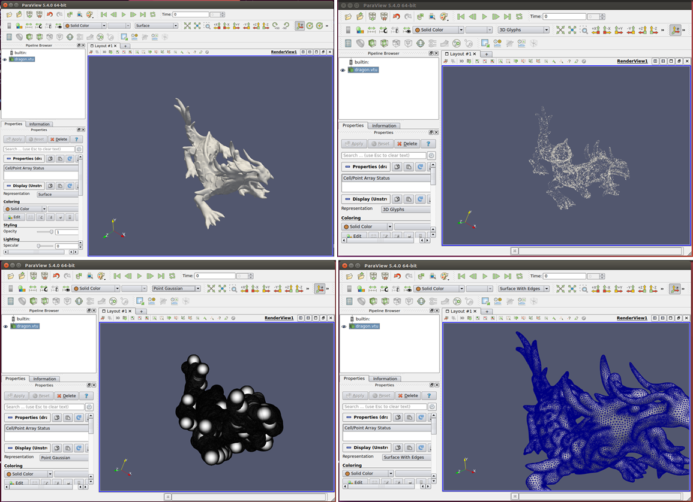
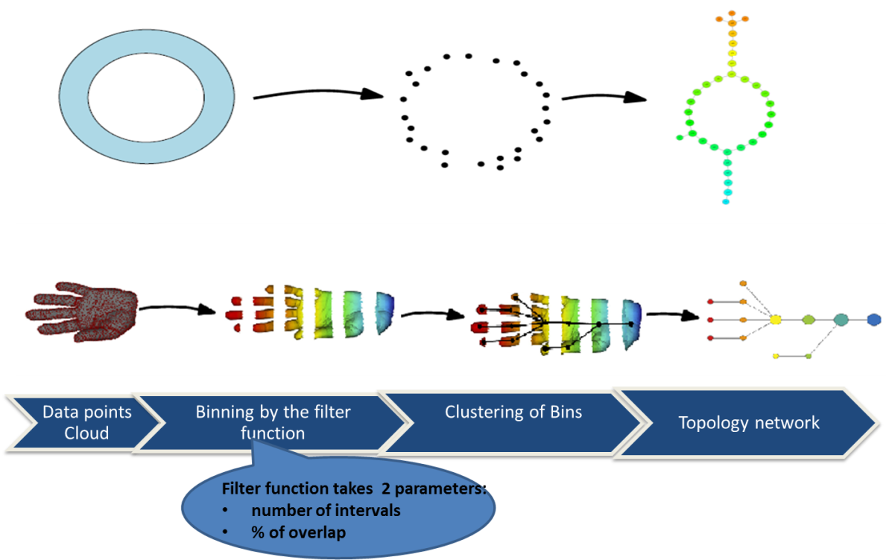
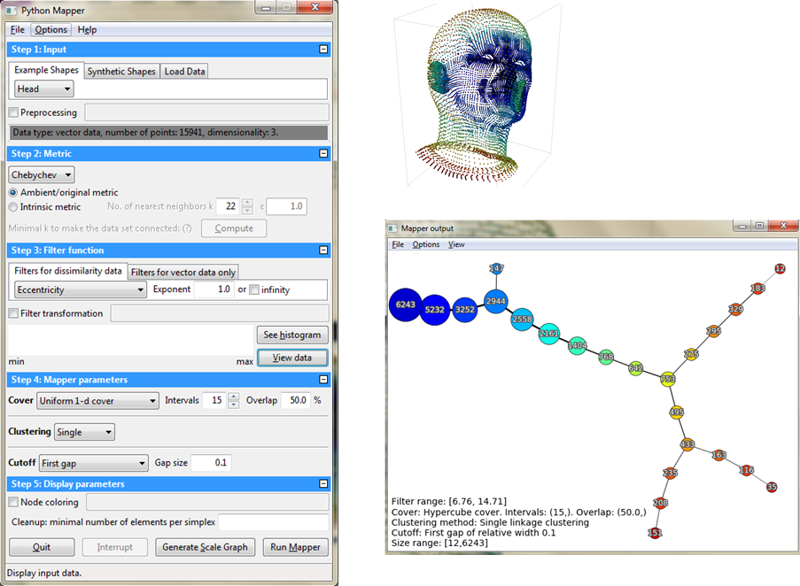
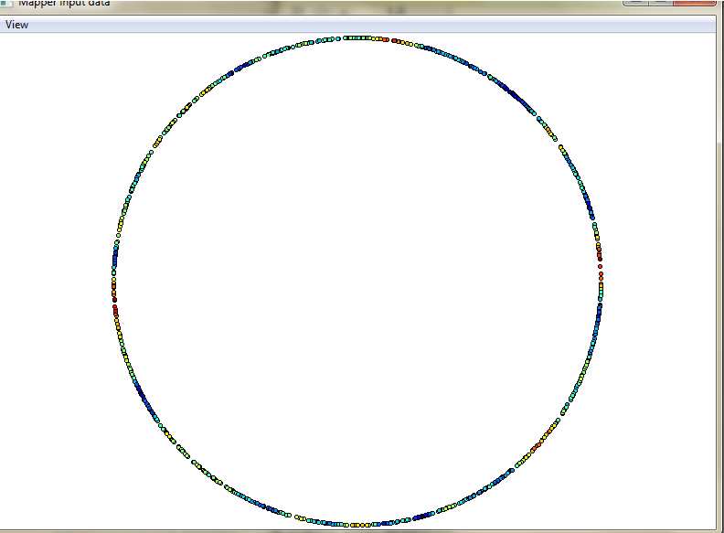
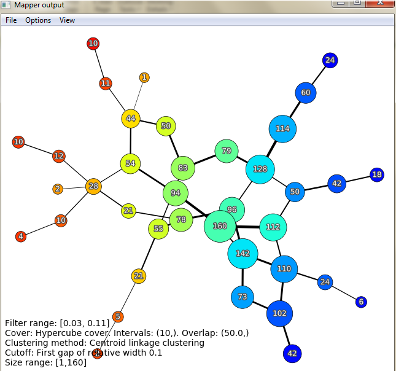
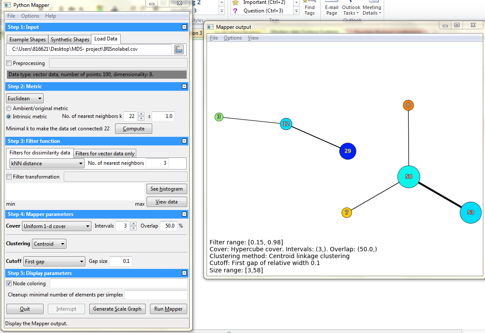
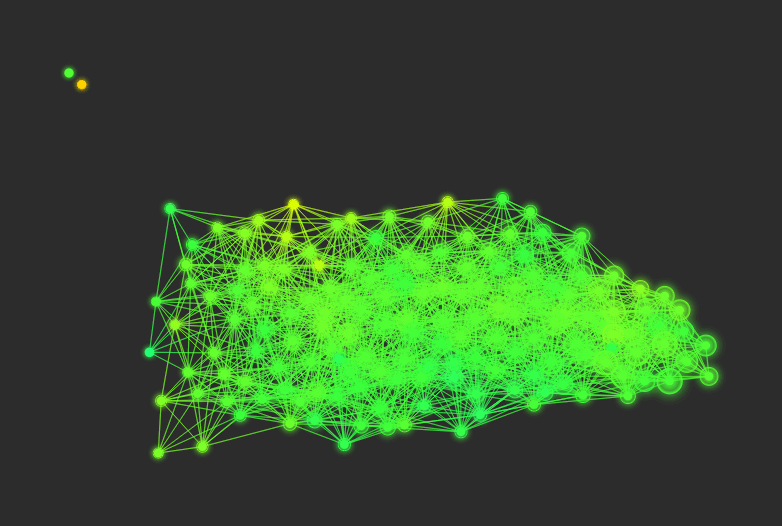
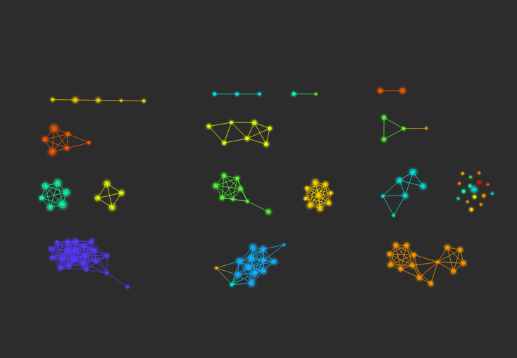

Introduction
============

Topology is a branch of mathematics concerned with those properties of geometric
configurations (such as point sets) which are unaltered by elastic deformations
(such as a stretching or a twisting) that are homeomorphisms (source:
https://www.merriam-webster.com/dictionary/topology).Topology deals with
qualitative geometric information including the study of what the connected
components of a space are, the study of connectivity information, which includes
the classification of loops and higher dimensional surfaces within the space.
(source: <http://www.ams.org/images/carlsson-notes.pdf>)

Topology includes the study of geometric properties which are much less
sensitive to the choice of metrics, such as curvature (source
:http://www.ams.org/images/carlsson-notes.pdf). Topology examines only the
properties of geometric objects which do not depend on the chosen coordinates,
and as such, topology is coordinate free (source:
<http://www.ams.org/images/carlsson-notes.pdf>).

**Why do we study Topological Data Analysis:**

Topological Data Analysis (TDA) provides a general framework to analyze
high-dimensional and noisy data in a manner that is insensitive to the
particular metric chosen and provides dimensionality reduction and robustness.
We are given data in the form of very long vectors, where all but a few of the
coordinates turn out to be irrelevant to the questions of interest, and often we
may not know which coordinates are the most interesting or relevant.
Furthermore, because topological data is often high-dimensional, our ability to
visualize topological datasets are normally quite restricted, and topological
data is often much noisier than other types of data, with more missing
information or missing data points.

**What is data transformation?**

It is Important to understand the “shape” of data to extract meaningful
insights. There are 3 key ways to do this transformation:

-   Study the distance function that specifies the shape, irrespective of the
    coordinate system chosen.

-   Study the properties of shapes that are invariant under “small”
    deformations. This makes study less sensitive to noise and thus, provides
    the ability to pick out the shape of an object despite countless variations
    or deformations.

-   Study how to replace complex data representations with simple compressed
    shapes. A good analogy for this concept is to represent a circle as a
    hexagon. In this case, we lose some information in the form of the curvature
    of the circle but retain the information that the data points establish a
    closed loop.

We can use this methodology for many practical industry applications like
feature selection to find the correlation between features and clustering.

| [./media/image1.png](./media/image1.png)                          | [./media/image2.png](./media/image2.png)                                     |
|-------------------------------------------------------------------|------------------------------------------------------------------------------|
| a) Use of Topological Data Analysis in identifying customer churn | b) Use of Topology in identifying the factors influencing Energy consumption |

Figure 1: Clustering to discern customers likely to shop elsewhere for targeted
advertising. Feature selection to correlate energy consumption factors.

Topological Data Analysis – The rationale
=========================================

| [./media/image3.png](./media/image3.png) |
|------------------------------------------|

Figure 2.Data shape assumptions in traditional machine learning models..

The different machine learning algorithms assume different shapes for the
underlying data. A regression model assumes a straight-line relationship between
the predictors and the dependent variables, A clustering model recognizes groups
of data points in a multidimensional space, and so on The figure 2 shows the
different shapes of data that the different machine learning algorithms assumes.
However the shape of real-time data points are always more complex or sometimes
a combination of many shapes(Example in Fig 3) which encode information. This is
the underlying assumption of TDA. It tries to identify the presence of loops or
flares in the dataset. (A flare as shown in the figure 2 above shows the generic
attribute on to the center and each of the specific attributes radiating at the
edges.)

*Figure 3. Example for the shape of a real dataset...*

The immense variety possible among shapes suggests that we should not attempt to
enumerate all the possible shapes with a individual mathematical approaches
(e.g. regression), and create templates for each, but rather find a flexible way
of representing all shapes. The figure 4 shows the same.

*Figure 4: Example of discovering internal patterns in the data*

*TDA vs Clustering:* As opposed to trying to find disjoint groups, TDA applies
clustering to small portions of your data. It then combines these “partial
clusters” into a network representation that gives an overview of the similarity
between your data points. In other words, TDA uses cluster analysis and builds
on top of clusters to provide higher precision. It takes advantage of geometric
patterns beyond simple clustering to give greater insight on high-dimensional
datasets. Hence, the TDA groups are more distinct and information loss is
minimal.

*TDA vs Dimensionality Reduction:* TDA eliminates the projection loss issue
typical of Dimensionality Reduction methods wherein data points that were well
separated in higher dimensions end up overlapping in a lower dimensional
projection. TDA achieves this by clustering the data in the original high
dimensional space. As a result, data points that were well separated in the
original space will typically be well separated in the TDA output.

*TDA vs Supervised learning Algorithms:* Most supervised learning algorithms are
based on global optimization. They try to assume a shape for the underlying data
and then find the parameters that best approximate all the data, thereby making
mistakes in some regions. TDA uses the output of these supervised algorithms as
an input to discover areas of the underlying data where errors are being made
systematically. TDA effectively constructs a collection or ensemble of models.

Tools in Topological data Analysis 
===================================

The two main tools explored as part of this project ars TTK and TDA Mapper. Both
TDA tools provide novel approaches to the problem of rendering high-dimensional
datasets as visualizations. Mapper excels in allowing the user to easily
identify relevant intersections and clusters in the data, by rendering
high-dimensional datasets as a 2-dimensional network map, whereas TTK provides
numerous different interpretations of the data points and easy manipulation to
see the visualizations from multiple angles. Mapper appears to be easier to
implement in a Windows environment, as long as the recommendations of Python
version and wxPython version are followed. TTK is the more challenging to
install in Windows, requiring a virtual machine running a Linux/Unix operating
system to complete the installation.

TTK
---

### Overview

The Topology Tool Kit is a TDA visualization suite designed to allow numerous
visualization options for rendering multi-dimensional datasets. In Figure 4, we
can see several of the options for 3-dimensional data visualizations. Please
note that there are numerous options available beyond those pictured.

**The different implementation options of TTK are given below:**

-   VTK-based generic GUI

-   Command line

-   Python

-   VTK/C++ integrated

-   C++

This software cannot be implemented on the Windows operating system. Linux and
iOS support this software implementation. For installation on a Windows
platform, we have to setup either Ubuntu or a similar Linux OS via virtual
machine before we can install TTK.

Some of the Topographical analysis algorithms that can be run with TTK include:

-   Critical points

-   Integral lines

-   Persistence diagrams & curves

-   Merge trees

-   Contour trees

-   Morse-Smale complexes

-   Fiber surfaces

-   Continuous scatterplots

-   Jacobi sets

-   Reeb spaces

### Installation tips

-   Ignore the advice of the developers, use QT4 (per their original
    instructions)

-   Latest version of QT5 causes errors in various C++ imports

-   Either setup swap file in Ubuntu for virtual memory, or allocate plenty of
    RAM (8GB if possible) on a virtual machine

-   You can configure to use QT4 executable and QT5 libraries

### Example

Figure 5: (L to R) Surface, 3D Glyphs, Point Gaussian, Surface with edges

TDA Mapper
----------

### Overview

The Mapper pipeline enables mapping from a higher dimensional space to a lower
dimension mapping for easier analysis. The data cloud points are captured, and
the filter function can apply up to 2 parameters, such as the number of
intervals and percentage of overlap. The clustering of bins is applied, and the
topology network is mapped into a lower, and easily understandable,
representation of the object.

Figure 6: The mapper pipeline - data points are binned by the filter function,
clustered, and rendered as a topological mapping of the data points.

The filter function essentially clusters the data points into multiple groups.
The colors in the output graph vary depending on the average value of the
filter. The first parameter of the mapper is the Distance metric- The various
metrics are Euclidean, Minkowski and ChebyChev. The filter functions used are
mainly the geometric filter functions and it depends on the distance function
used for example various proxies for distance-based density, measures of
centrality, and various coordinates of a multidimensional scaling analysis etc.
Eg: L-infinity centrality, for a data point x, y= max distance from any other
point. So larger values implies how far it is from the center. Although, some
applications like PCA might use geometric filters. The next two inputs to the
mapper are the resolution parameters -Number of intervals(N) and the percentage
of overlap respectively. The dataset is binned unto groups in such a way that
the filter values lie within the single interval with certain degree of overlap
set by the parameter. Since we chose the intervals to be overlapping, the binned
data represents a systematic oversampling of the original data. The final
parameter is to understand the appropriate clustering scheme. The basic
clustering algorithm is the single linkage algorithm.

-   Construct the single linkage histogram for the data in a bin and record the
    threshold for each transition

-   Build histogram of these transition values for 'k' intervals

-   Clustering is performed using the last threshold before the first gap in
    this histogram.

The clustering scheme gives us partial clusters and these partial clusters are
connected by an edge of they have one or more data points in common.

### Installation

-   The Python application for this installation requires version 2.7 and will
    not work with 3.x due to wxPython limitation.

-   Requires wxPython less than version 4.0+ and gives an error on import
    wxversion.

-   numpy+mkl library is required, and numpy alone will not work. To resolve
    this issue, we needed to install from the whl file available for download
    from <http://www.lfd.uci.edu/~gohlke/pythonlibs/>. It is important to
    download the correct version for your operating system (Windows/Linux) and
    architecture (32 or 64 bit).

### Examples

The figure 7 shows the TDA mapping for data points that’s hold the shape of a
head.

*Figure 7: Mapper Demo 1*

The key in the TDA network formation is the choice of parameters in the filter
function. If this is not chosen correctly, the network will make no sense. The
figure 7 shows the topology graph for a set of data points in circle layout. The
resultant network is just meaningless.

*Figure 8: Mapper Demo 2*

Practical Implementation of TDA
-------------------------------

We implemented TDA on the conventional Iris dataset to see the formation of
topology graph and understand how it would be comparable to the traditional
K-Means clustering. The figure 9a shows the cluster output by k means clustering
and the Figure 9b shows the topology map. Each of them show the presence of two
adjacent clusters and a third cluster that is quite distance from the other two.
Please note that the systematic oversampling in TDA results in more number of
sample cases in each of the groups identified.

*Figure 9: Mapper Demo 3 a) Kmeans Clustering output b) TDA output*

TDA- Does it work always?
=========================

The figure 9 shows the use case of applying topological data analysis to a
dataset of 5000 points. The distance metric chosen was Euclidean metric and the
initial results turns out to be a featureless blob. (Figure 10a). There is no
localization of classes using the Euclidean metric. Hence the distance metric
was changed into random forest hamming metric(Figure 10b). Although Random
forest could classify the dataset better, it alone was not able to capture the
noise in the data. This shows that TDA and Machine Learning go hand in hand to
give better performance than each of them working individually.

*Figure 10 a)No localization of the classes in the Euclidean metric.b)  Random
forest hamming metric*

Conclusion
==========

We can conclude that Topological data analysis (TDA) will enrich the way we do
data analysis, especially in the insights it can offer us in high dimensionality
data. TDA has practical applications in different verticals like Medicine for
study of complex neurological disorders and for data driven discovery in
preclinical traumatic brain injury (TBI) and spinal cord injury (SCI)
(<https://www.ncbi.nlm.nih.gov/pmc/articles/PMC4634208/>), studies associated
with complications after allogeneic stem cell transplantation
(http://www.cell.com/cell-reports/fulltext/S2211-1247(17)31113-0), population
genomics and metagenomics
(http://researcher.watson.ibm.com/researcher/view_group.php?id=6585), day
trading cryptocurrency and for technical analysis of market data
(<https://twitter.com/mlwave/status/909660461712527361>) and in manufacturing,
for the accurate prediction of machine systems output
(<http://www.sciencedirect.com/science/article/pii/S0278612517300286>).

With the ability to give additional insights and even improve upon conventional
methods like Clustering and Principal components analysis, TDA is poised to play
a very important role in data science, especially with the complex and often
noisy and messy datasets, which seem to be the norm rather than an exception in
today’s environment. With recent studies that have concluded that TDA and
Machine learning go hand in hand and together give better performance than each
of them working individually, we can conclude that there will be more areas of
research in which TDA will play a major role in the foreseeable future.

References
==========

https://en.wikipedia.org/wiki/Topological_data_analysis

https://www.google.com/url?sa=t&rct=j&q=&esrc=s&source=web&cd=1&cad=rja&uact=8&ved=0ahUKEwjw__awoK7XAhUBXSYKHQfzCwAQFggoMAA&url=http%3A%2F%2Fcdn.ayasdi.com%2Fwp-content%2Fuploads%2F2015%2F02%2Fwp-tda-and-machine-learning.pdf&usg=AOvVaw16iLOQG5QwMJRBu2ebxxLe

Lum, P. Y., et al. "Extracting insights from the shape of complex data using
topology." Scientific reports 3 (2013): 1236.

https://s3.amazonaws.com/cdn.ayasdi.com/wp-content/uploads/2017/06/20174822/UnderstandingAyasdi_WP_061617v011.pdf

https://www.kdnuggets.com/2015/09/ayasdi-topological-analysis-machine-learning.html

<https://www.ayasdi.com/blog/machine-intelligence/why-tda-and-clustering-are-different/>

<https://www.ayasdi.com/blog/bigdata/understanding-distinction-clustering-tda/>

<https://www.slideshare.net/kimheekimi/tda-for-feature-selection-57375430>

https://gist.github.com/calstad/01e174faff2cdca7faf9

http://danifold.net/mapper/

https://github.com/topology

https://github.com/topology/tool/kit/ttk/data
