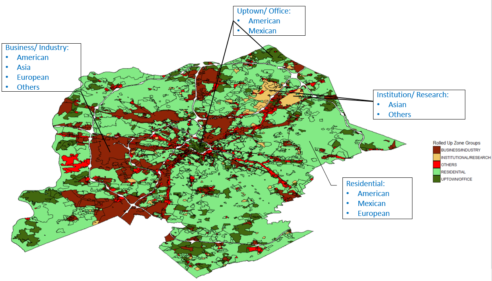
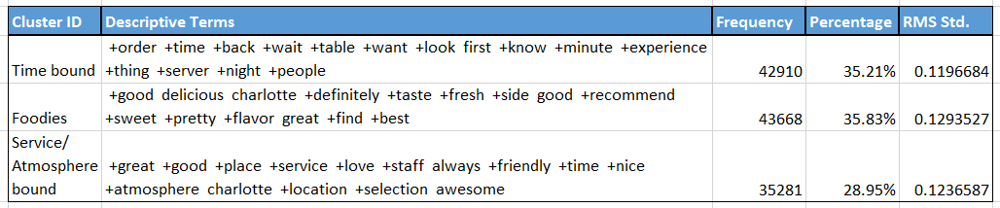
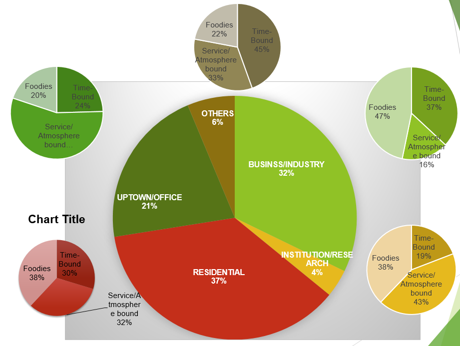
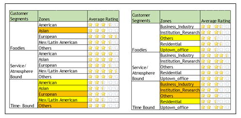
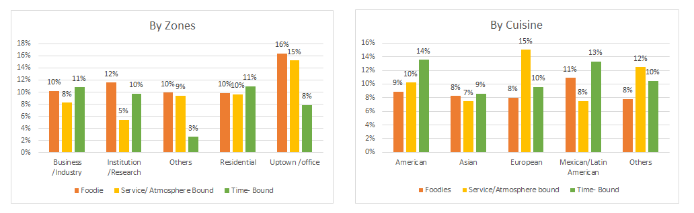
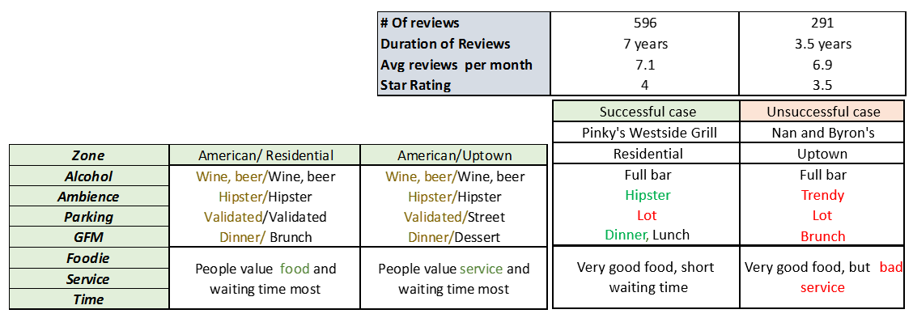

Author(s) 
==========

| Saritha Ramkumar <sramkuma@uncc.edu>                    | Madlen Ivanova <mivanov1@uncc.edu> | Sugandha Mann <smann11@uncc.edu> |
|---------------------------------------------------------|------------------------------------|----------------------------------|
|                                                         |                                    |                                  |
| Sampa Sanyal <ssanyal@uncc.edu>                         | Kartik Niyogi <kniyogi@uncc.edu>   |                                  |
|                                                         |                                    |                                  |
| Masters candidates in Data Science & Business Analytics |                                    |                                  |
| University Of North Carolina at Charlotte (UNCC)        |                                    |                                  |
| Team : Super 5                                          |                                    |                                  |

Faculty Advisor 
================

Prof. Sangkil Moon,  
Cullen Endowed Professor of Marketing,  
The Belk College of Business - UNC Charlotte,  
Email: smoon13\@uncc.edu

Summary
=======

Charlotte is among the fastest growing cities with rapid expansion in both
business and population. One such opportunity is presented by restaurant
business in Charlotte.

Our work focuses on gaining in-depth understanding of consumer’s heterogeneous
preferences toward various restaurant attributes by analysing consumer’s
restaurant reviews on Yelp.com. We identify key attributes to particular
cuisines (e.g., Italian, Japanese) at a specified area (e.g., residential,
uptown) to help restaurant managers understand the Charlotte restaurant
business, and thereby, help investors identify effective investment
opportunities.

Problem and Motivation
======================

Because of the tremendous gain in computing power, storage space, and
accessibility in the recent past, text mining and analytics has set its foot in
almost all businesses across the world; even the restaurant industry is no
exception. The Impact of food Innovations has been tremendous in restaurant
business, the results of which is evident in the evolution of so called
‘theme-based’, ’chef driven’, ’concept based’, ‘fresh produce’, and the list
goes on. Although the mobile apps and other services offered by Yelp, Groupon,
ChowNow etc. happen to be the lifeline of restaurants, unravelling useful
information from review texts offered businesses an innovative avenue to
understand customer feedback and opportunities. This project aims at identifying
how consumers’ restaurant preferences vary across zones/localities within the
city of Charlotte, based on the customers’ own reviews in Yelp. This will cater
to new and existing business to improve and alter their key competencies based
on their chosen target customers’ expectations.

Approach 
=========

We attempted to understand how cuisine preferences and locality influenced the
success of restaurants in and around the Charlotte area. Being the third-fastest
growing major city in the United States, restaurants here offer a plethora of
options in terms of ambience, parking space, price range, drive through,
delivery, pet friendliness etc. However, the customers, on the other hand, are
also keen on a different set of attributes such as friendliness of staff, wait
time etc. along with food taste and quality. The weightage of these preferences
varied totally based on both locality and cuisine type. Hence, we found it
important to analyze business characteristics and customer preferences
separately to get the complete picture.

To achieve this, the analysis proceeded with three main objectives:

1.  Identifying important business characteristics and trends of the Charlotte
    restaurant business industry

2.  Understanding customers’ overall preferences for restaurants and identifying
    multiple customer segments in Charlotte

3.  Contrasting customers’ differential preferences among Charlotte areas and
    cuisine type

Datasets
========

The complete dataset consisted details of all business from 11 cities across 4
countries. The data was sub-set to include Charlotte specific restaurants
business. The final list comprised of the details of 2,140 restaurant business
with a total of 121K review texts. The data was available in JSON format in two
large files business and reviews. The business dataset provided business
specific information such as Name, location, attributes, category, Star rating,
and review counts. The reviews dataset consisted of information on review text,
date of publish, star rating etc. which was linked to the business file based on
the business id. The dataset in JSON format were converted to CSV using Python.
Data preparation and merging were carried out in MySQL and Excel.

The city of Charlotte zoning data is coded in geospatial shape files (.shp) with
each zones marked by area and shape. The latitude and longitude data from the
business file in Yelp is linked to the area coordinates to mark the zone of each
restaurant in the business file. The geospatial merging discussed here we
carried out in R programming. The Charlotte county had 23 unique zones. For the
sake of ease of analysis, the 23 city zones were rolled up into 5 zones-
Uptown/Office, Residential, Industry/ Business, Institution/Research and others
based on the similarity. Fig.1 summarized the zones.

Tools & Analytics
=================

**Tools used**: MySQL, R, Python, SAS Enterprise Guide, SAS Enterprise Miner,
Excel Analytics Solver platform, Excel VBA

**Data Analysis:** In-line with objective, data was analyzed across three areas:

1.  *Attributes impacting consumer preference:* First activity was to analyze
    the impact of attributes with categorical and metric values on Star ratings.
    Primary attributes were identified and consumer preference around these
    attributes were analyzed using Conjoint Analysis (performed with the help of
    Excel Analytics Solver Platform). Impact of other secondary attributes on
    Star ratings were analyzed using Regression and Decision Tree using SAS
    Enterprise Miner.

2.  *Categorizing reviews:* Reviews were analyzed by identifying key topics
    using Word-Clouds and generating restaurant ontology from “Review” corpus.
    SAS Enterprise Miner was used to perform Topic modeling by Cuisine across
    various attributes like Customer Experience, Entertainment, Taste, Wait
    time, Go With (e.g. friends, family etc.). Topics driving good/poor Star
    rating were generated across categories like Food, Service and Price.
    Concept links were used to understand the association among attributes.

3.  *Customer Segmentation based on reviews:* The text clustering of reviews
    helped in segmenting customers into three prominent categories: Time,
    Service/Ambience and Taste. The segments hence identified by applied to the
    zones and the major cuisine types to see the distribution. Tabulating the
    results against the mean star rating of the zone helped to gauge the
    customer likings for each of the segment. Lastly, cross referencing the
    percentage of closed restaurant in each zone/cuisine for reach segment
    helped to understand how the likings influenced the success of restaurants.

Results
=======

1.  *Attributes impacting consumer preference:*

    Five primary attributes were identified: Alcohol Availability, Restaurant
    Ambience, Parking, Good For Meals, and Price. Using conjoint analysis,
    relative importance of each of these attributes were assessed across cuisine
    and zone. Also, within each attribute the sub-attribute with highest utility
    was recorded.

    Referring to Table 1 in appendix, Customers visiting American cuisine
    restaurants value Ambience and Parking as primary significant attributes.
    Within Ambience, they prefer “Hipster” ambience, while validated parking is
    preferred over other formats of parking. However, for Mexican cuisine
    restaurant customers valued Price as the primary attribute (while also
    preferring it to be expensive as shown by 4) and valued Ambience (“Hipster”)
    as secondary attribute. Similarly, for customers visiting Uptown/ Office
    area, primarily value Ambience (“Hipster”) while Price (“4-expensive”) as
    secondary attribute.

    Based on above consumer preference, the attributes can be mapped to cuisines
    and zones. This shows the preference across each cuisine and opportunity
    zone for setting up restaurants. The visual representation on Charlotte map
    is shown in Fig. 1

    Remaining 24 secondary attributes such as bike parking, Drive Thru,
    Delivery, Happy Hours, Noise Level, Credit Card acceptance, TV etc. were
    analyzed using Regression and Decision Tree. Both of these models will be
    further tuned to get better results.

2.  *Identifying relevant attributes in restaurant business through the voice of
    the consumer:*

    Topic modeling based on consumer reviews helped identify factors driving
    Star Ratings across good/poor restaurants. Comparison of leading key terms
    across different cuisine category is shown in Table 3. The terms that were
    most often associated with each cuisine have been highlighted in blue. For
    instance, the term “Good/ Great” in context of American cuisine was most
    often used for “variety,” while that in European restaurants it was used for
    “staff” and “atmosphere”. This association was obtained using concept links
    that highlight most associated words with key terms.

3.  *Customer Segmentation in cuisine and zone:*

    The objective of the analysis is to segment the customers based on the set
    of words they repeat or prioritize in their reviews. The three major
    segments analysed were time-bound, service/atmosphere bound, and foodie
    customers. A strong stopword list to eliminate other attributes and keywords
    were pivotal in the analysis. The clusters describing the segments were
    cohesive and equidistant in the vector space. Table 3 summarizes the same.

    We can understand the prominent words associated with each attribute by
    cuisine and zone. E.g. In reviews of Asian cuisine about 45% of the reviews
    found mention of Service/ Atmosphere, which is substantially higher than
    other two segments. In American cuisine, each of the segments were almost
    uniformly mentioned. Average customer ratings for each cluster is shown in
    the Table 4 helps to gauge the sentiment of these customer segments.
    Furthermore, the percentage of closed restaurants reviewed by each customer
    segments are shown in Fig.2. In that figure can be seen that the
    Uptown/Office restaurants need to improve quality of food. Need for
    improvement in Time management is common across Zones (Residential, Business
    & Institution areas) and Cuisine (American, Asian & Mex/ Latin).

Contributions and Uniqueness
============================

*Case Study:* Pinky's Westside Grill vs. Nan and Byron's

>   Based on the analysis of customer preferences above, we examine the
>   attributes of a successful restaurant versus an unsuccessful (closed)
>   restaurant. As can be seen from Table 6, both restaurant belong to American
>   cuisine. Pinky’s has been in existence for about 7 years while Nan & Byron’s
>   closed down in 3.5 years. Both have an average monthly review of
>   approximately 7 and similar average Star rating of 4 and 3.5 respectively.
>   The factors that favour successful restaurant is highlighted in Green while
>   that for unsuccessful restaurant is shown in Red. Pinky’s Westside succeeds
>   over Nan & Byon on Ambience, Good for Meal and Short Service Time which is
>   in-line with the characteristic of its cuisine and location as can be seen
>   in the “American/Residential” section.

Irrespective of the features offered at a restaurant, customers look for majorly
three factors- time bound service, hospitality of staff and quality of food.
But, the preference among these attributes may vary highly among the locality
and cuisine type. Hence, in order to cater to these demands, even different
franchises of the same chain may have to tailor these attributes based on zones
and/or cuisine type. For example,the customers of uptown restaurants are more
concerned about the wait time than about the food or staff hospitality, whereas,
customers who reviewed about restaurants in business/industrial area are more
inclined towards the food taste and quality than about waiting time or the
services offered.

-   Similarly,

    If an investor is looking to setup an American cuisine restaurant, then
    ideal value proposition to the customers would be “Hipster” ambience along
    with “validated” parking. The consumers would value specials along with
    variety in menu options. Timely service of the order is also a critical
    aspect.

    On the other hand if investor is choosing Institutional/ Research location
    then the ideal value proposition to the customers would be a relative less
    expensive restaurant with “Classy” ambience. An improved food quality while
    maintaining the price would help gain better market share.

Appendix: Visualization / analytics summary (up to two pages)
=============================================================

Table 1: Customer Preference across key attribute

Figure 1: Charlotte Map: Zone vs Cuisine

Table 2: Comparing key terms across Cuisine

  
**Table 3: Clusters describing Customer segments**

**Table 4: Segments by zone and Mean customer ratings by zones and cuisine
type**

Figure 2: Percentage of closed restaurants reviewed by each customer segments

Table 5: Case Study: Pinky's Westside Grill Vs Nan and Byron's

References
==========

1.  Primary dataset: <https://www.yelp.com/dataset_challenge>

2.  City of Charlotte Zoning Data:
    <http://clt-charlotte.opendata.arcgis.com/datasets/17a4cbd948934fae8a63139a8e371000_8>

3.  National Restaurant Association, “Big Data and Restaurants: Something to
    Chew On””

4.  Matt Wolff, March 2011, “The Best 10”, Restaurant Growth Index
